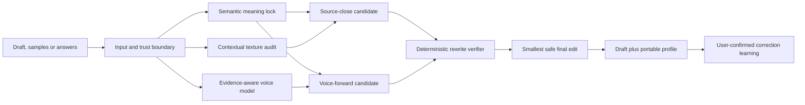

# Write Like Me

**Remove generic AI texture. Keep your meaning. Learn what actually sounds like you.**

**Website:** [hoplittlebunny.github.io/write-like-me](https://hoplittlebunny.github.io/write-like-me/)

**Quick start:** [Try it in two minutes](https://hoplittlebunny.github.io/write-like-me/test/#quick-start)

Write Like Me is an open-source AI writing skill that combines semantic safeguards with applied linguistic evidence. It can clean or audit a one-off draft, learn a portable writing pattern from genuine samples or a few natural answers, rewrite new material in that pattern, and learn only the corrections the user explicitly confirms.

It is not a banned-word list, a voice-cloning claim, an authorship detector, or an AI-detector bypass.

## The problem

Most “humanizers” work at the surface. They swap fashionable words, add contractions, break sentences into punchy fragments, or impose somebody else's idea of casual writing. The result may look less polished while saying something subtly different or sounding like a different generic persona.

Write Like Me separates three jobs:

1. **Meaning:** what must remain true.
2. **Texture:** which generic model habits weaken this particular draft.
3. **Voice:** which behavioural patterns are actually supported by the user's writing.

That separation is the core product.

## What it does

- **Pattern audit:** quotes affected lines, names contextual AI-texture risks, and suggests the smallest fix without rewriting or guessing authorship.
- **Draft cleaning:** removes generic framing, hollow abstraction, mechanical symmetry, fake profundity, and other weak patterns while preserving strong human sentences.
- **Writing-pattern learning:** measures supported tendencies from genuine writing, typed answers, or dictation and records evidence quality instead of pretending certainty.
- **Voice-aware rewriting:** transfers rhythm, stance, explanation order, paragraphing, and reliable surface habits without copying old topics, anecdotes, names, or distinctive phrases.
- **Semantic verification:** checks important values, dates, URLs, email addresses, quotes, polarity, modality, entities, autobiographical claims, and sample leakage.
- **Correction learning:** turns a user edit into the smallest contextual rule, asks for confirmation, and stores it in a portable Markdown profile.
- **Private continuity:** keeps the reusable state in `MY_WRITING_PATTERN.md`, under the user's control, with no Write Like Me server or silent account memory.

## Why semantics and linguistics matter

The project treats a rewrite as a constrained transformation, not free-form paraphrasing.

Before editing, it builds a meaning lock around the thesis, claims, positive and negative polarity, names, numbers, dates, quotations, caveats, uncertainty, audience, and requested format. Style can move; those constraints cannot move silently.

The personal pattern uses applied linguistic signals such as:

- sentence and clause movement;
- discourse order and transitions;
- stance, certainty, hedging, and epistemic footing;
- directness and relationship to the reader;
- rhythm, sentence-length variation, and deliberate fragments;
- paragraph shape and information density;
- vocabulary level and recurring functional choices;
- punctuation only where the evidence source makes punctuation reliable;
- register and context stability.

These are behavioural observations, not identity biometrics. Signals are labelled `Observed`, `Preferred`, `Tentative`, `Rejected`, or `Unknown`, and the overall profile is labelled `Starter`, `Emerging`, or `Strong` according to bounded evidence rules.

## Architecture

The runtime is deliberately small:

- `SKILL.md` routes the user request and enforces the product contract.
- `references/` contains the contextual texture catalogue, evidence model, conversation contract, architecture, question bank, and output contracts.
- `build_starter_voice_file.py` creates an evidence-labelled portable profile.
- `verify_rewrite.py` blocks selected semantic regressions and style-sample leakage.
- `update_writing_pattern.py` records confirmed corrections without storing draft text.

Read [ARCHITECTURE.md](docs/ARCHITECTURE.md) for the full design, trust boundaries, evidence model, and failure strategy.

## Quick start

Try one of these:

> Audit this draft for generic AI patterns. Quote the evidence and suggest the smallest fixes. Do not rewrite it.

> Remove the AI texture from this draft without changing my point or making me sound like a LinkedIn template.

> I do not have samples. Ask me two or three natural questions and build a starter writing pattern from my answers.

> Use my attached `MY_WRITING_PATTERN.md` to rewrite this new draft. Preserve every fact and do not invent personal experience.

## Install

### Codex or another OpenAI plugin host

Upload the OpenAI plugin ZIP from the latest release where plugin installation is supported.

### Claude or another Agent Skills host

Upload the Claude Skill ZIP from the latest release. The portable skill contains `SKILL.md`, references, and the three runtime scripts.

### From source

Clone the repository and use `skills/write-like-me` as the skill directory. No server, database, account, API key, or third-party Python package is required.

## Privacy

The plugin has no external backend and independently collects nothing. The selected AI host still processes the conversation under its own policies. Generated profiles and diagnostics remain user-controlled local files; raw writing is omitted from diagnostic JSON by default.

Read the full [Privacy Policy](PRIVACY.md) and [Terms of Use](TERMS.md).

## Validation status

The repository includes deterministic unit tests, activation fixtures, adversarial input cases, end-to-end scenario contracts, and a blind-beta harness. Automated checks cover evidence handling, Unicode text, dictated input, duplicate samples, prompt-injection boundaries, package contents, correction persistence, and rewrite verification.

Passing automated checks does not prove that every host model will produce a preferred voice match. Human preference on unseen topics remains the final acceptance test.

## What we learned from No AI Slop

Peter Yang's open-source [No AI Slop](https://github.com/petergyang/no-ai-slop) made the category better. Its clear detect-only audit, concrete pattern naming, minimum-effective-edit discipline, and preservation of draft-local voice directly challenged us to sharpen those parts of Write Like Me.

Write Like Me adds a different layer: evidence-aware personal patterns, provenance and confidence controls, correction learning, untrusted-sample isolation, and deterministic rewrite verification. It uses contextual judgement rather than banning ordinary words or constructions outright.

See [ACKNOWLEDGEMENTS.md](ACKNOWLEDGEMENTS.md). No endorsement or collaboration is implied.

## Contributing

Issues, examples, and pull requests are welcome. Do not post private writing samples in public issues. Read [CONTRIBUTING.md](CONTRIBUTING.md) and [SECURITY.md](SECURITY.md) first.

## Licence

[MIT](LICENSE) © 2026 Amit Sharma.
